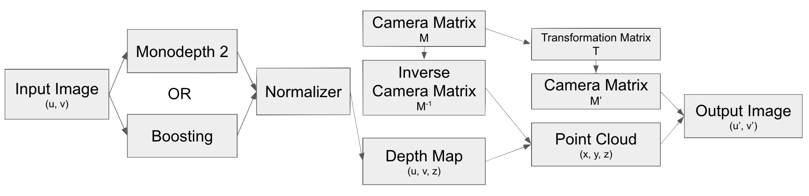

# Augmented Perspective

Generate alternative 2D images viewed from different perspectives given a single 2D image.

## Architecture

The project uses a generic [DepthModel](models/base_model.py) class to wrap around different monocular depth
estimation models to create pixel-by-pixel depth map given a 2D image. It then normalizes the depth map for next step
processing. In the reprojection step, it uses a known or estimated camera matrix to reproject the 2D image with a
translation and rotation. A translation is always needed to accompany a rotation as we want to keep the image at the
center. Lastly, from the point cloud generated by the reprojection, it outputs the final image with augmented
perspective of the scene.



After rotation, some pixels originally hidden in the scene will be exposed and shown as black pixels. Current
implementation can handle thin black lines by extrapolating these pixels using surrounding ones. Work is in
progress to use Generated AI to fill in large black areas in upcoming versions. 

Example output from [datasets/kitti/images/kitti3.png](datasets/kitti/images/kitti3.png):


## iPython Notebook

An [example notebook](AugmentedPerspective.ipynb) is created to demonstrate how to use this library in an interactive
environment. This notebook can run on [Google Colab](https://colab.google/) and has been tested with the repo fetched
to a Google Drive root directory or root shortcut named `augmented-perspective`

## Example Command Line Usage

### Step 1: Preparation

Makesure `Python 3.11` or above is installed, create a virtual environment

```shell
python3 -m venv augmented_persective_venv
cd augmented_persective_venv
source ./bin/activate
```

Install requirements

```shell
cd <path_to_this_project>
python -m pip install --upgrade pip
python -m pip install -r requirements.txt
```

### Step 2: Given a 2D RGB image, uses a monocular depth estimation model to estimate the depth of each pixel.

Running this with a single model in [models/](models) with a single image, saving output to `outputs/`

```shell
python -m depth_model --image_path datasets/kitti/images/kitti3.png --depth_model boosting --output_path outputs
```

Running this with all models in [models/](models) with all images in a directory, saving output to `outputs/`

```shell
python -m depth_model --image_path datasets/kitti/images/ --output_path outputs
```

To make this step faster, run this with `cuda` and append `--device cuda` to command line arguments 

### Step 3: Using a known or estimated camera projection matrix, re-project the 2D image after applying a rotation or translation**

Run this with a single model in [models/](models) with a single image, reproject it with saving output to `outputs/`

```shell
python -m augmented_perspective --image_path datasets/kitti/images/kitti3.png \
      --depth_map_path outputs/kitti3_boosting_depth.npy --depth_mode boosting 
```

Run this with a single model in [models/](models) with a single image, saving output to `outputs/`

```shell
python -m augmented_perspective --image_path datasets/kitti/images/kitti3.png \
      --depth_map_path outputs/kitti3_boosting_depth.npy --depth_mode boosting 
```

### Step 4: Do this with multiple angles to create a 3D like video effect shown above

This creates 30 frames covering rotation from 0 degree to 25 degree with 0.6 pixels camera translation to the left. 

The resultant files are saved to `kitti3_boosting_gif/`

```shell
python -m augmented_perspective --image_path datasets/kitti/images/kitti3.png \
     --depth_map_path outputs/kitti3_boosting_depth.npy --depth_mode boosting \
     --output_path kitti3_boosting_gif --angle 25 --frames 30 --translation -0.6 \
     --scale_ratio 100 --save_filled_only
```

### Step 5: Merge these images into a single GIF

```shell
 python -m create_gif --output_path kitti3_boosting_gif --use_existing_image --loop_reverse
```

Open `kitti3_boosting_gif/kitti3_boosting_gif.gif` to see the outcome.

## Usage and Help

Three main tools are used in this project:

### depth_model

```text
$ python -m depth_model --help
before ['/Users/siyuanhe/Library/CloudStorage/GoogleDrive-hsysuper@gmail.com/My Drive/UCB Documents/SCPD Documents Autumn 2020/CS231A/Project/augmented-perspective/depth_model.py', '--help']
after ['/Users/siyuanhe/Library/CloudStorage/GoogleDrive-hsysuper@gmail.com/My Drive/UCB Documents/SCPD Documents Autumn 2020/CS231A/Project/augmented-perspective/depth_model.py', '--help']
usage: depth_model.py [-h] [--depth_model {monodepth2,boosting}] [--image_path IMAGE_PATH] [--output_path OUTPUT_PATH] [--device DEVICE]

Depth model initialization.

options:
  -h, --help            show this help message and exit
  --depth_model {monodepth2,boosting}
                        name of depth model used for creating depth map under models/, allowed = ['monodepth2', 'boosting']
  --image_path IMAGE_PATH
                        path to a test image or folder of images
  --output_path OUTPUT_PATH
                        output path
  --device DEVICE
```

### augmented_perspective

```text
$ python -m augmented_perspective --help
usage: augmented_perspective.py [-h] [--image_path IMAGE_PATH] [--depth_map_path DEPTH_MAP_PATH] [--depth_model {monodepth2,boosting}] [--output_path OUTPUT_PATH] [--save_filled_only | --no-save_filled_only] [--angle ANGLE] [--translation TRANSLATION] [--frames FRAMES] [--scale_ratio SCALE_RATIO] [-d]

Augmented perspective module initialization.

options:
  -h, --help            show this help message and exit
  --image_path IMAGE_PATH
                        path to a test image
  --depth_map_path DEPTH_MAP_PATH
                        path to depth map of test image
  --depth_model {monodepth2,boosting}
                        name of depth model used for creating depth map under models/, allowed = ['monodepth2', 'boosting']
  --output_path OUTPUT_PATH
                        output path
  --save_filled_only, --no-save_filled_only
                        whether to only save the filled image without saving raw rotation only images
  --angle ANGLE         angle in degree to rotate the image perspective clockwise around x-axis
  --translation TRANSLATION
                        linear translation of the camera, some translation is needed after rotation to keep image centered
  --frames FRAMES       number of frames to rotate, 0 if only one frame is needed. As a result 0 and 1 has the same effect
  --scale_ratio SCALE_RATIO
                        scaling ratio of the depth map during normalization
  -d, --debug           Print lots of debugging statements up to DEBUG level
```

### create_gif

```text
$ python -m create_gif --help
usage: create_gif.py [-h] [--image_path IMAGE_PATH] [--depth_map_path DEPTH_MAP_PATH] [--depth_model {monodepth2,boosting}] [--output_path OUTPUT_PATH] [--save_filled_only | --no-save_filled_only] [--angle ANGLE] [--translation TRANSLATION] [--frames FRAMES] [--scale_ratio SCALE_RATIO] [-d]
                     [--use_existing_image | --no-use_existing_image] [--loop_reverse | --no-loop_reverse]

Tool to create GIF clips from augmented perspective images

options:
  -h, --help            show this help message and exit
  --image_path IMAGE_PATH
                        path to a test image
  --depth_map_path DEPTH_MAP_PATH
                        path to depth map of test image
  --depth_model {monodepth2,boosting}
                        name of depth model used for creating depth map under models/, allowed = ['monodepth2', 'boosting']
  --output_path OUTPUT_PATH
                        output path
  --save_filled_only, --no-save_filled_only
                        whether to only save the filled image without saving raw rotation only images
  --angle ANGLE         angle in degree to rotate the image perspective clockwise around x-axis
  --translation TRANSLATION
                        linear translation of the camera, some translation is needed after rotation to keep image centered
  --frames FRAMES       number of frames to rotate, 0 if only one frame is needed. As a result 0 and 1 has the same effect
  --scale_ratio SCALE_RATIO
                        scaling ratio of the depth map during normalization
  -d, --debug           Print lots of debugging statements up to DEBUG level
  --use_existing_image, --no-use_existing_image
                        Try to use existing image from output_path to create GIF
  --loop_reverse, --no-loop_reverse
                        Play images in reverse order after playing them forward
```

### DepthModel

To extend this project, one can create a new directory under [models/](models) using the following structure:

```text
    models/
        __init__.py
        your_model/
            __init__.py
            depth_prediction.py
            ... other_files_as_needed ...
```

and in `depth_prediction.py`, extend [DepthModel](models/base_model.py) class, overriding `__init__()`, 
`get_depth_map()`, and `require_normalization()` methods

### Datasets

New datasets can be added to [datasets](datasets/) directory by creating a new directory. If camera intrinsic matrix
is known, you can create an `__init__.py` and implement `get_intrinsic_matrix(image_path: pathlib.Path) -> pathlib.Path`

## Credit and Citation

This project was completed as the final project for the Winter 2022 [CS231A: Computer Vision, From 3D Reconstruction to 
Recognition](https://web.stanford.edu/class/cs231a/) at Stanford University by Jack He, Eric Lou, and Ryan Kirk